**Team Name:**

**Finding Diego**

Team ID: 6235

Justin (A0281106N)

Seung-Yoon (A0271949M)

**Game Name:**

**Arctic Meltdown**

# Contents Page

[Project Information	3](#projectinformation3)
[Project Scope:	4](#projectscope4)
[Game Overview	4](#gameoverview4)
[Storyline	4](#storyline4)
[Class Hierarchy	5](#classhierarchy5)
[Randomised Map Concept	5](#randomisedmapconcept5)
[User Stories	7](#userstories7)
[Development	7](#development7)
[Technical Specifications	8](#technicalspecifications8)
[Tech Stack	8](#techstack8)
[Technical Proof	10](#technicalproof10)
[Features	11](#features11)
[UI Menus	12](#uimenus12)
[Main Menu	12](#mainmenu12)
[Pause Menu	13](#pausemenu13)
[Death Menu	13](#deathmenu13)
[Camera Effects	13](#cameraeffects13)
[Enemies	14](#enemies14)
[Patrolling Enemy:	14](#patrollingenemy14)
[Flying Enemy:	14](#flyingenemy14)
[Ranged Enemy:	14](#rangedenemy14)
[Collectables	14](#collectables14)
[Health Pickup:	14](#healthpickup14)
[Coin Pickup:	14](#coinpickup14)
[Power Ups	15](#powerups15)
[User Testing	16](#usertesting16)
[System Testing	17](#systemtesting17)
	[Tests	17](#tests17)
[Automated Testing	19](#automatedtesting19)
[Credits:	20](#credits20)

# Project Information

**Team Name:**

Finding Diego

**Team ID:**

6235

**Team Members:**

Justin Jiang Wei Ren

Lee Seung-Yoon

**Proposed Level of Achievement:**

Apollo 11

**Milestone 1 poster & video:**

[Poster](https://drive.google.com/file/d/12Y4OTWq55PIMI71SirAqkBy-Gqgpz-OR/view?usp=sharing)

[Video](https://drive.google.com/file/d/13ck6s_eUe7smBAuWM6p2yGlZoIleFSJi/view?usp=sharing)

[Gameplay](https://youtu.be/qSDbttn50ic)

**Milestone 2 poster & video:**

[Poster](https://drive.google.com/file/d/1ek4KPCn5ZWHhbTDdzvCMsu1DZr5jX3ku/view?usp=sharing)

Video

[Gameplay](https://youtu.be/xD9OHaOqOlo?si=0PAOq18ak1xSL_nn)

**WebGL build:**

[https://play.unity.com/mg/other/webgl-builds-416307](https://play.unity.com/mg/other/webgl-builds-416307) 

**Project Log:**

[https://docs.google.com/spreadsheets/d/1ZYDImVzhaMfZO1SMuhPQhXTh90gGAyS1mkKerMLbqsg/edit?usp=sharing](https://docs.google.com/spreadsheets/d/1ZYDImVzhaMfZO1SMuhPQhXTh90gGAyS1mkKerMLbqsg/edit?usp=sharing) 

**GitHub Repository:**

[Arctic Meltdown GitHub Repo](https://github.com/LEESY02/ArcticMeltdown)

**Motivation**

We have always enjoyed playing games since we were young and wanted to try making games. From MOBA games to open world RPGs, we have enjoyed a variety of different genres of games. We want to create a game that gives people a rush of excitement and adrenaline, as well as the urge to continue playing, just like the experiences we had playing our favourite games.

**Aim**

We want to create a 2D Platformer Game that is engaging and accessible. This means focusing on clear mechanics that are easy to grasp but offer depth and challenge as players progress. On the technical side, smooth gameplay is a priority. We'll strive for clean, efficient code that minimises bugs and ensures a frustration-free experience. This might involve using beginner-friendly tools or frameworks initially, while keeping an eye on learning more advanced coding techniques as we develop our skills.

# Project Scope:

## Game Overview

*One sentence version**:*

"Arctic Meltdown" is a 2D platformer where players guide Pippin, a prehistoric penguin, through a melting Arctic, uncovering ancient mysteries and overcoming obstacles in a visually captivating adventure.

*Longer descriptive version**:*

"Arctic Meltdown" is a 2D platformer game that follows the journey of Pippin, a prehistoric penguin, as he navigates through an ever-changing and melting Arctic environment. Players will guide Pippin from the depths of the Earth’s core, overcoming various obstacles and uncovering the mysteries of his ancient world. It promises an engaging and visually captivating journey that blends adventure and platforming elements. By guiding Pippin through his icy adventure, players will experience a rich storyline and challenging gameplay, making "Arctic Meltdown" a memorable addition to the 2D platformer genre.

## Storyline

Deep beneath the ice, where the ancient whispers of the Earth are frozen in time, lived a prehistoric penguin named Pippin. Pippin, whose existence was a testament to a forgotten era, had been in a state of suspended animation for millennia. His coat was as dark as the midnight sea, and his eyes sparkled with the wisdom of ages past. However, the relentless grip of global warming had finally reached his icy sanctuary, and the thawing ice gently nudged him back to consciousness.

Awakening from his long slumber, Pippin found himself in a world vastly different from the one he knew. His heart, stout and courageous, beat with a renewed purpose:

**The journey back to the Arctic surface.**

Are you ready to step into the ice and relive the past? Guide Pippin through his perilous journey, unravel the mysteries of the ancient world, and overcome the odds in this unforgettable adventure.

# Class Hierarchy 

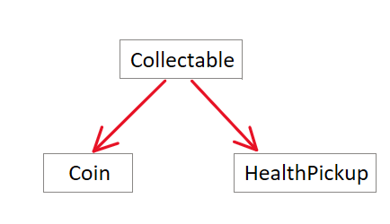

# Randomised Map Concept

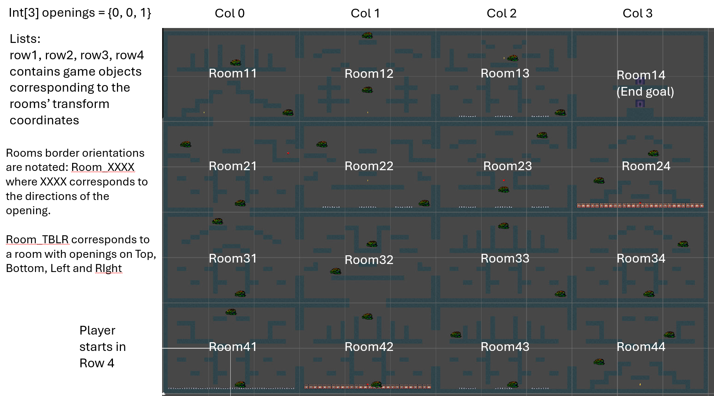

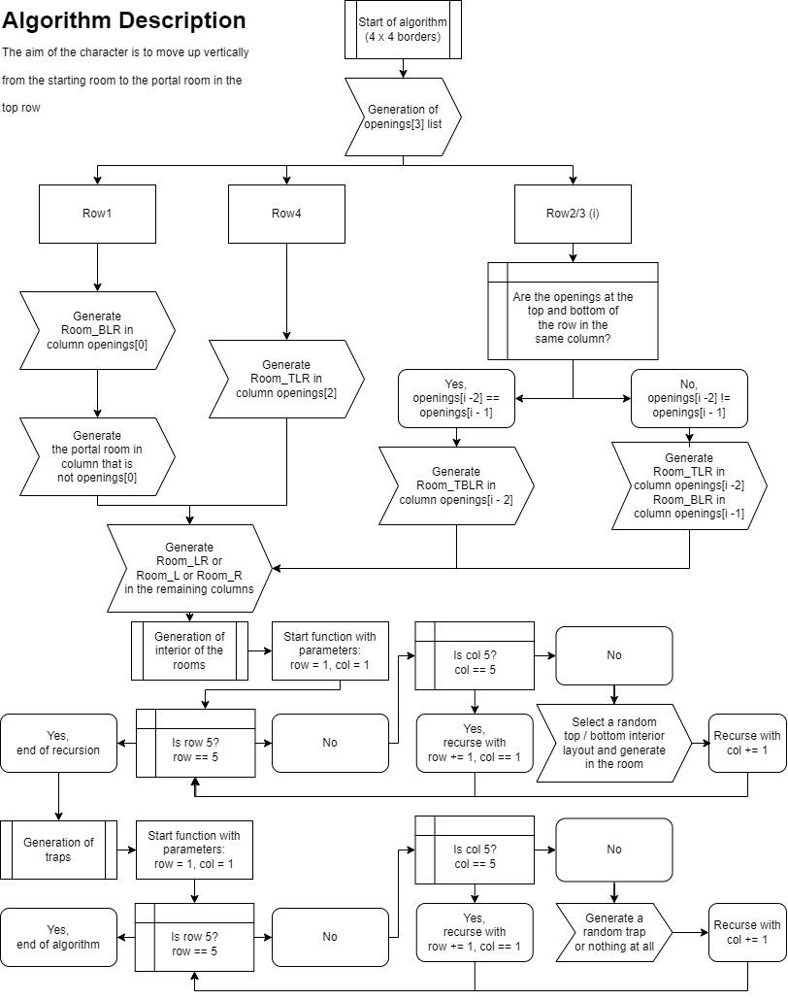

# User Stories

1. As a player, I want to control Pippin's basic movements so that I can navigate through the levels.

2. As a player, I want to help Pippin overcome obstacles so that I can progress through the game.

3. As a player, I want to engage with and defeat enemies so that I can protect Pippin and advance through the game.

4. As a player, I want to discover new areas and biomes so that I can explore different environments within the game.

5. As a player, I want to use collected coins to purchase upgrades for Pippin so that I can enhance his abilities and improve my gameplay experience.

6. As a player, I want to collect health pickups scattered throughout the levels so that I can restore Pippin’s health and survive longer.

7. As a player, I want to be able to reach different levels of difficulty so that it enhances my ability to deal with more.

## Development

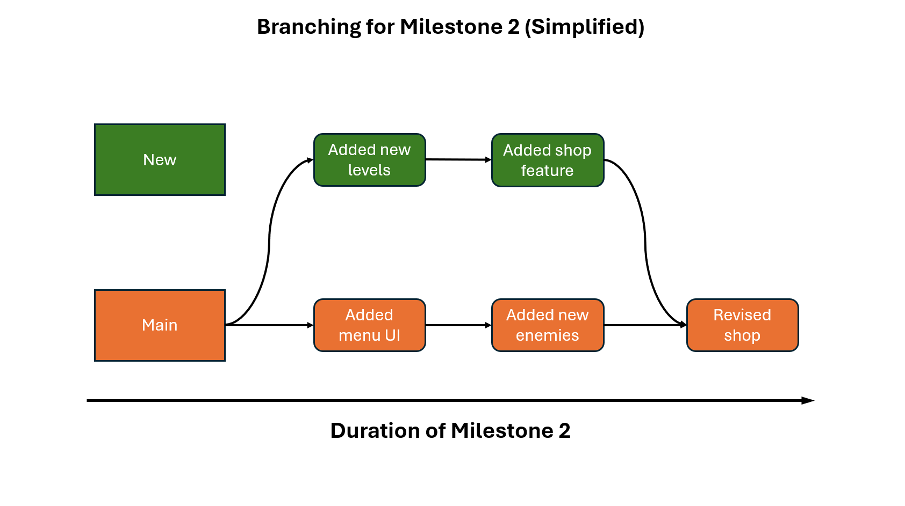

The above is an example of how we tracked the development using git on Github, through basic branching and merging.

# Technical Specifications

1. Platform:

1. Requires a 64-bit processor and operating system

2. Minimum OS requirement: Windows 10 64-bit

2. Engine: Unity

3. Graphics:

3. Pixel Art style and 2D animations to create a unique visual experience.

4. Sound and Music:

4. Sound effects for character actions, environmental interactions, and enemies.

5. Ambient background soundtrack for a relaxing feel.

5. Controls: Keyboard and mouse

# Tech Stack

- Unity

- Github

- Adobe premiere

- Canva

**Application usage (Only supports Windows OS)**

1. Download the zip file from [here](https://drive.google.com/file/d/1-Eg3JEUq-2xCyNNIyLDWlODXQxVxd3jG/view?usp=sharing).

2. Extract the contents of the zip file to your preferred destination.

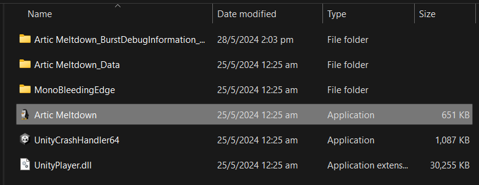

4. Once the game file runs, the game will begin. Control Player movements with

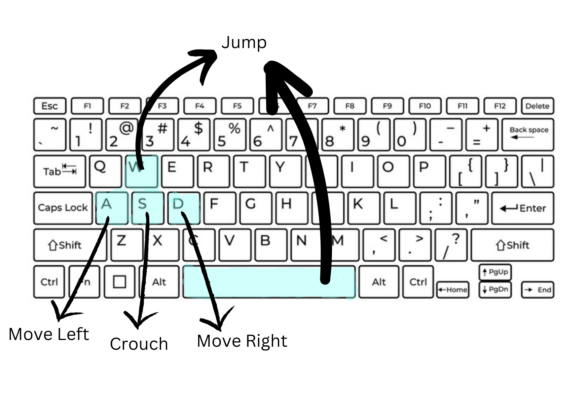

1. “W” or “Space” key to jump.

2. “A” key to move left.

3. “D” key to move right.

4. “S” key to crouch.

5. Left-click to attack

5. Game objective is to make it to the last level without losing all your health.

# Technical Proof

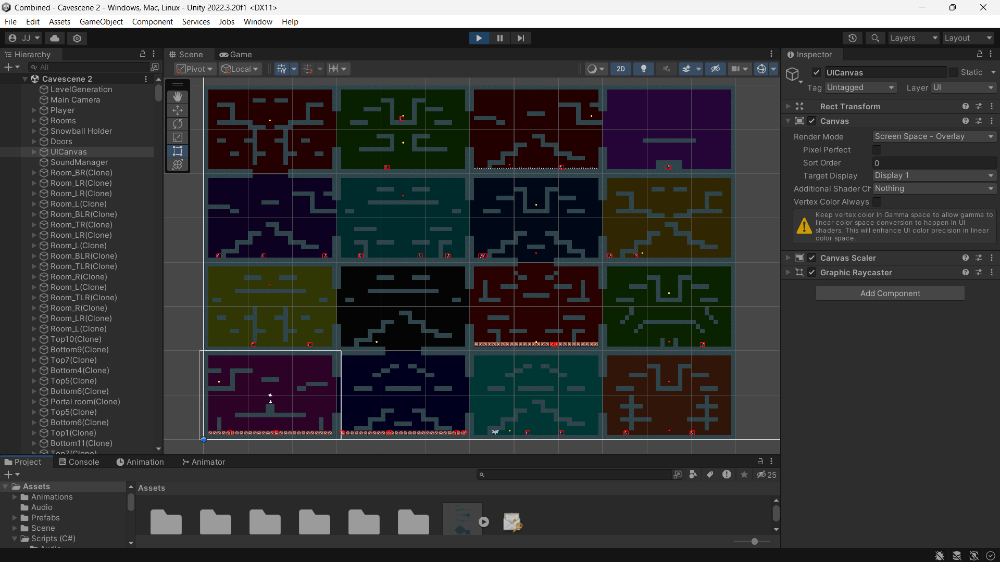

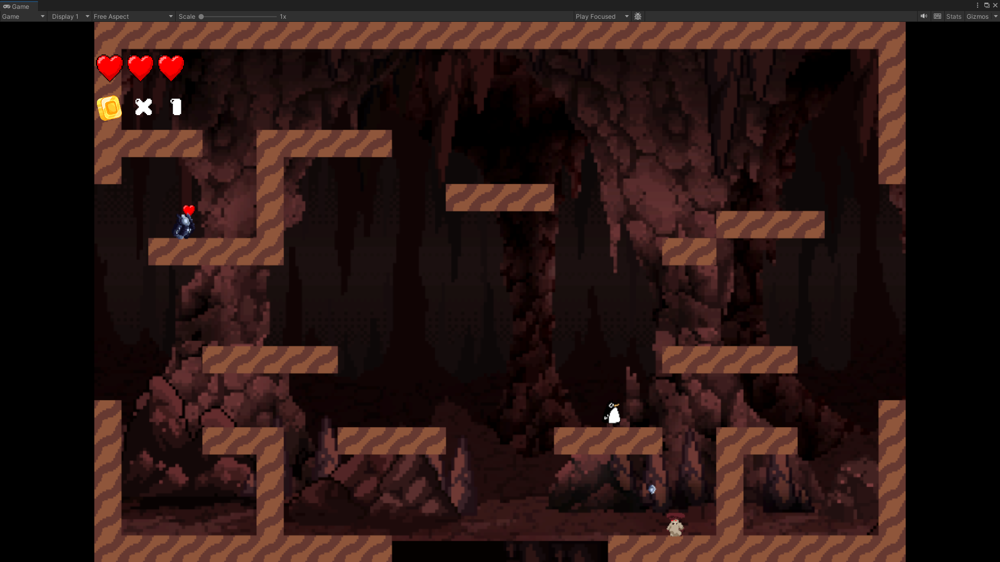

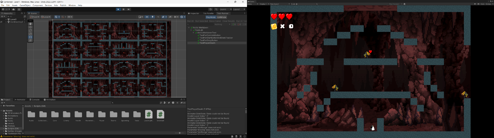

# Features

1. Story:

1. Immersive storyline focusing on Pippin's awakening and journey overcoming enemies within the Earth’s crust.

2. Levels and Environments: .

2. Progressive Difficulty: Increasingly challenging levels with new obstacles and enemies.

3. Randomised Maps: Every replay of the game will regenerate a new map at random, ensuring an almost new feel to the game, no matter how many times you replay it.

3. Character Abilities:

4. Basic Movements: Walking, jumping, sliding

5. Attacks: Melee and Ranged

4. Multiple UI screens:

6. Main Menu: To allow for easy navigation to different segments of the game.

7. Pause Menu: To allow players to take a quick break or restart if their progress is unsatisfactory. Also allows players to easily adjust the volume of the in-game sound effects.

8. Death Menu: Similar to the Pause Menu.

5. Enemies and Obstacles:

9. Hazards: Traps

10. Enemies: Ancient Creatures that have awakened alongside Pippin, consisting of 3 main types:

1. Patrolling (Melee)

2. Ranged

3. Flying (Melee)

# UI Menus

# 

## Main Menu

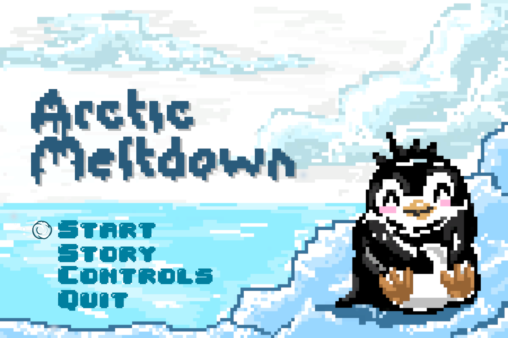
Upon Entering the game, the user will be brought to the main menu screen where he will be given the option to read the jump right into the game, read the story of Pippin, see the instructions on the controls of the game, and to exit the game.

The STORY button will bring the user to a scene with multiple pages. The user can use the “PREVIOUS” and “NEXT” buttons at the bottom of the screen to navigate between the pages and read up on the story of Pippin.

The CONTROLS button will bring the user to a page that will show the controls of the game, allowing new players to familiarise themselves with the keys to press in order to play the game. The Main Menu button at the bottom right of the page allows for the user to return to the main menu to begin their adventure.

## Pause Menu

Upon pressing the *escape key* while the game is active, time within the game will come to a stop and the pause menu will be activated. The image above shows what players will be shown upon pausing the game. By using the *arrow keys* to navigate the snowflake across the options, players can adjust the volume of the in-game sounds and music just by clicking on the respective buttons. They can choose to return back to the main menu or even quit the game from there. Upon resuming, time within the game will return back to normal. 

## Death Menu

When the player’s health falls below 1, the player will die and a loud bell will ring. This will activate the Death Menu. From here, the player will be able to decide whether to return to the main menu, restart the level, or exit the game. Restarting the level will restart the game from the latest level reached by the player, with full health, and the player’s original coin count.

# Camera Effects

On top of the respective camera scripts written for the various camera effects such as camera shaking, or following the Player from room to room, we have added a “Pixel Perfect Camera” component to all our camera game objects to change the look of our non pixelated sprites into a pixel art, enhancing our choice of a pixel art design for our game.

# Enemies

## Patrolling Enemy

- Moves back and forth within the platform area

- Attacks upon contact with Player

- Melee attacks

## Flying Enemy

- Has a small detection range

- Will chase Player upon detection

- Returns back to its original position once Player escapes the detection range or leaves the current room

- Melee attacks

## Ranged Enemy:

- Has a small detection range

- Will be alerted once Player enters detection range

- Will attack Player upon detection

- Stop attacking once player leaves the detection range or leaves the current room

- Ranged and Melee attacks

# Collectables

## Health Pickup:

The health pickup is represented using a heart shape, which is the same as the health icons on the top left of the screen, signifying the player’s health. Colliding into the health pickup will replenish 1 of the hearts lost if the player's health is not full.

## Coin Pickup:

The coin pickup is represented using a coin icon. A tracker of how many coins the player has collected while playing the game is positioned at the top left of the screen UI, right below the health. Collecting a coin will increase the tracker count. At the end of each level, the player will be able to access a shop where he can use the collected coins to purchase power ups to upgrade their skills as the game progresses to further later levels.

# Power Ups

Each power up costs 3 coins to purchase.

They are currently only purchasable at the end of each level.

| Name | Description | Icon |
|---|---|---|
| Increased Maximum Health | Maximum number of hearts the Player can possess will be increased by one.
(i.e. more health) |  |
| Increased Movement Speed | Player’s horizontal movement speed is doubled.
(i.e. run faster) |  |
| Increased Jump Count | Maximum number of consecutive jumps before landing on the ground or wall is increased by one.
(i.e. more jumps) |  |
| Increased Jump Force | Height of each jump is increased by 2 units.
(i.e higher jumps) |  |
| Reduce Attack Cooldown | The duration of the interval between consecutive attacks from the player is reduced.
(i.e. faster attack speed)
 |  |

# User Testing

On 18th June, We conducted a few tests by playing the game ourselves and letting our friends play it too. We have then recorded down the feedback gathered and implemented the respective changes for an improved experience.

Criticism:

- Jumping feels like “floating”

- Sometimes player gets stuck to the walls

- Controls might not be obvious for new players

- Too difficult to find coins

- Pause menu still accessible when death screen is active

- Flying enemies chases Player into next room

- Ranged enemies from other rooms also attacks the Player if within range

- Unable to tell at which range the ranged enemies detect the Player

- Death menu does not activate when Player dies mid-air

- Going from pause screen to main menu, and then to a new game will result in the game freezing

Compliments:

- Game startup is pleasing to watch

- Randomness of map layouts interesting to explore

- Death screen very nice

- Pleasing background music

- Game controls are easy to learn and pick up.

Improvements:

- Added increased gravity when falling downwards

- Added material with no friction to box colliders to prevent sticking

- Added a controls page that players can access from the main menu

- Increased the spawn rate of coins within the maps

- Fixed issue to make pause screen inactive if death screen is active

- Flying and ranged enemies now check if Player is in the same room before attacking

- Added “alerted” animation for ranged enemies, giving the Player a visual cue upon detection

- Activation of the death menu changed to player health rather than death animation

- Reset the time back to normal speed when exiting the pause menu no matter what

# System Testing

We conducted a series of tests to ensure that the following features function as expected. We integrated both *automated *testing and *manual *testing. 

### Tests

| Test Case Number | Test Case | Results |
|---|---|---|
| 1 | Open game for the first time | Camera begins shaking and then pans upwards shortly after to the top where the Main Menu is. |
| 2 | Click the “Controls” button | Brings the user to a page showing the keybinds to play the game. |
| 3 | Click the “Quit” button | Game exits back to the desktop if the game is downloaded onto the Windows device. If playing the WebGL build, the game will freeze. |
| 4 | Click the “Story” button | Game brings the user to a screen showing multiple pages of the game’s storyline. |
| 5 | Click the “Start” button | Game begins with the player having 3 hearts and 0 coins. |
| 6 | Left-click in game | Player’s “attack” animation is activated and snowball objects shoot out of the player's front. |
| 7 | Click the “escape” key on the keyboard in game | Pause Menu is activated and time in-game is halted. |
| 8 | Click the “Resume” button in the Pause Menu | Pause Menu is deactivated and time in-game is returned back to normal. |
| 9 | Colliding with the floating coins | Coin counter at the top left of the screen increases the count by one. |
| 10 | Colliding with floating hearts | If health is not full, the number of red hearts at the top left of the screen will increase by one, else nothing will happen. |
| 11 | Click the “Main Menu” button from the Pause Menu | The Main Menu scene is loaded in. |
| 12 | Click the “Sounds” button from the Pause Menu | The volume of in-game sound effects changed. The number next to the button updates accordingly. |
| 13 | Click the “Music” button from the Pause Menu | The volume of the background music changed. The number next to the button updates accordingly. |
| 14 | Lose all health in game | Death Menu screen is activated. |
| 15 | Click the “Main Menu” button from the Death Menu | The Main Menu scene is loaded in. |
| 16 | Click the “Quit” button from the Death Menu | Game exits back to the desktop if the game is downloaded onto the Windows device. If playing the WebGL build, the game will freeze. |
| 17 | Click the “Restart” button from the Death Menu | Current level is reloaded with the original health and coins that the player entered the level with. |
| 18 | Get attacked by enemies | If Health before being attacked is more than one, one of the red hearts in the health bar will turn black. Else Death screen will be activated. |
| 19 | Exit current room and enter the next room | Camera will pan to the player's current room. |
| 20 | Enter range of ranged enemies | The “alert” animation of the enemy will play, followed by the enemy throwing a rock in the direction of the player’s current position. |
| 21 | Enter range of flying enemies | Flying enemies will begin flying towards the Player and when close enough, will perform a melee attack on the Player. |
| 22 | Stand in front of patrolling enemies | When the enemy walks up to the Player, it will stop upon contact and attack the Player repeatedly until the Player dies. |
| 23 | Walk into portal object in the Exit room | The next level is loaded in and camera pans to the Player in the new room location. |
| 24 | Move horizontally while crouching | Slide animation is active and Player’s speed is increased slightly. Particle effects are also present. |

# Automated Testing

We have integrated Unity's automated testing unit into our development process to enhance our testing procedures. We've incorporated various test cases within our Test script and utilised the Test Runner to execute them, ensuring the reliability and functionality of our game features.

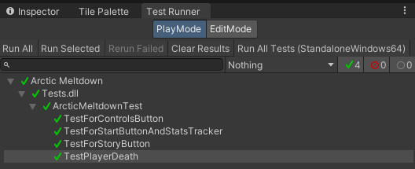

This approach streamlines our testing efforts significantly. Instead of manually testing the game after every code update or component addition, we rely on automated tests to verify both existing and newly implemented features, ensuring seamless integration and maintaining overall product quality.

**Current Progress:**

- Maps generation works

- Player movement and interaction is smooth

- Patrolling melee enemy functional

- Flying enemies functional

- Ranged enemies functional

- Traps and hazards functional

- End of game scene

- Integrated audio into the game

- Health system works

- Game camera movement follows player stage

- Starting behaviour of the camera allows for a quick visual introduction of the game.

- Player attack works

- The multiple UI screens work.

**To-do:**

- Implement a proper shopping system so as to allow players to choose what to buy, rather than being forced to buy what powerup is randomly spawned

- Improve UI for smoother user experience

- Update the art for the “Story” component of the game

# 

# Credits

Sound Effects:

- [https://pixabay.com/sound-effects/snowball-smash-1-36743/](https://pixabay.com/sound-effects/snowball-smash-1-36743/) 

- [https://pixabay.com/sound-effects/arrow-impact-87260/](https://pixabay.com/sound-effects/arrow-impact-87260/) 

- [https://pixabay.com/sound-effects/shoot02wav-14562/](https://pixabay.com/sound-effects/shoot02wav-14562/) 

- [https://pixabay.com/sound-effects/breaking-glass-88411/](https://pixabay.com/sound-effects/breaking-glass-88411/) 

- [https://pixabay.com/sound-effects/cartoon-jump-6462/](https://pixabay.com/sound-effects/cartoon-jump-6462/) 

- [https://pixabay.com/sound-effects/male-hurt7-48124/](https://pixabay.com/sound-effects/male-hurt7-48124/) 

- [https://pixabay.com/sound-effects/coin-pickup-98269/](https://pixabay.com/sound-effects/coin-pickup-98269/) 

- [https://pixabay.com/sound-effects/healpop-46004/](https://pixabay.com/sound-effects/healpop-46004/) 

- [https://pixabay.com/sound-effects/healpop-46004/](https://pixabay.com/sound-effects/healpop-46004/) 

- [https://pixabay.com/sound-effects/squeal-thing-103111/](https://pixabay.com/sound-effects/squeal-thing-103111/) 

- [https://pixabay.com/sound-effects/071989-man-screams-in-pain-61964/](https://pixabay.com/sound-effects/071989-man-screams-in-pain-61964/) 

- [https://pixabay.com/sound-effects/health-pickup-6860/](https://pixabay.com/sound-effects/health-pickup-6860/) 

2D Assets:

- [https://assetstore.unity.com/packages/2d/characters/enemy-galore-1-pixel-art-208921](https://assetstore.unity.com/packages/2d/characters/enemy-galore-1-pixel-art-208921) 

- [https://assetstore.unity.com/packages/2d/characters/pixel-adventure-1-155360](https://assetstore.unity.com/packages/2d/characters/pixel-adventure-1-155360) 

- [https://assetstore.unity.com/packages/2d/characters/2d-character-sprite-animation-penguin-236747](https://assetstore.unity.com/packages/2d/characters/2d-character-sprite-animation-penguin-236747) 

- [https://assetstore.unity.com/packages/2d/characters/100-fantasy-characters-mega-pack-222143](https://assetstore.unity.com/packages/2d/characters/100-fantasy-characters-mega-pack-222143) 

- [https://assetstore.unity.com/packages/2d/environments/2d-platfrom-tile-set-cave-61672](https://assetstore.unity.com/packages/2d/environments/2d-platfrom-tile-set-cave-61672) 

- [https://assetstore.unity.com/packages/2d/environments/free-platform-game-assets-85838](https://assetstore.unity.com/packages/2d/environments/free-platform-game-assets-85838) 

- [https://assetstore.unity.com/packages/2d/characters/warped-caves-103250](https://assetstore.unity.com/packages/2d/characters/warped-caves-103250)

- [https://assetstore.unity.com/packages/2d/environments/pixel-fantasy-caves-152375](https://assetstore.unity.com/packages/2d/environments/pixel-fantasy-caves-152375) 
